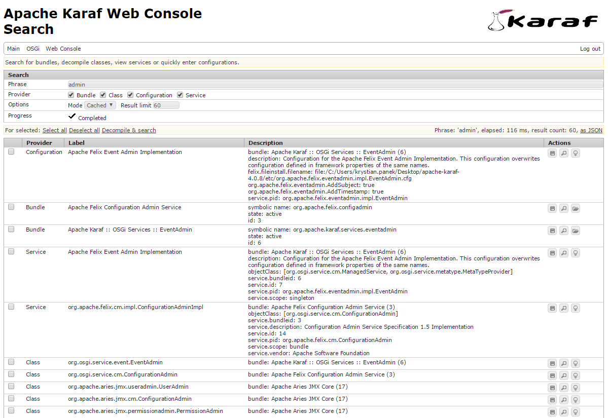
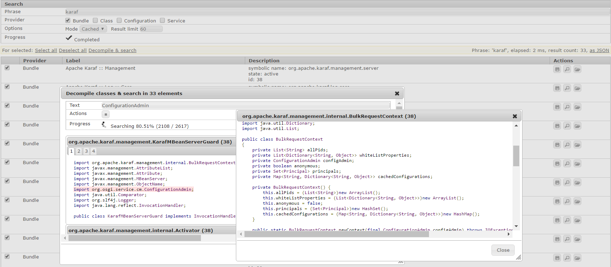
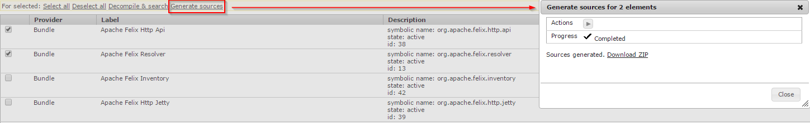
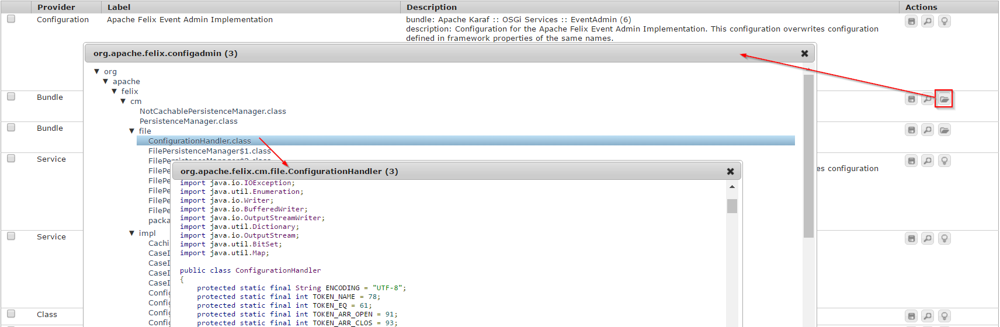
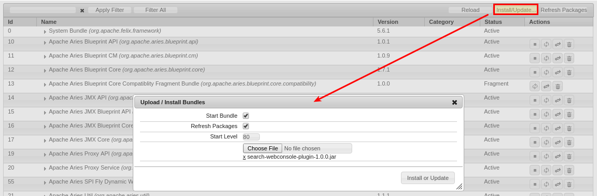
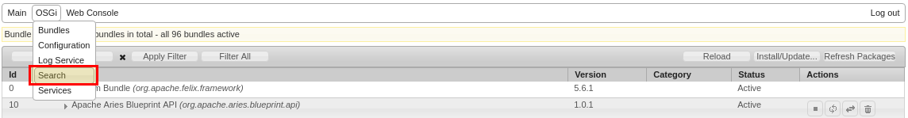

[](https://github.com/neva-dev/felix-search-webconsole-plugin/stargazers)
[](https://twitter.com/intent/tweet?text=Wow:&url=%5Bobject%20Object%5D)
[](http://www.apache.org/licenses/)

# Search Web Console Plugin for Apache Felix

Search for bundles, decompile classes, view services and quickly enter configurations.
Works on OSGi distributions based on Apache Felix such as Apache Sling, Apache Karaf, Apache ServiceMix etc.

## Features:

* searching for bundles, services, configurations and classes (with wildcard support),



* searching in decompiled classes sources that come from selected elements (e.g multiple bundles),



* generating ZIP file with all:
   * decompiled class sources from selected elements (e.g multiple bundles),
   * bundle JAR's related with selected elements



* bundle class tree view with jumping between decompiled class sources,



* one-click bundle JAR download.

You liked plugin? Please don't forget to star this project on GitHub :)

## Setup

Manually install ready to use bundle *search-webconsole-plugin-x.x.x.jar* using web console interface.





### Compatibility

| Search Plugin | Apache Felix Web Console (Sling/Karaf) | AEM Classic  | AEM SDK       |
|---------------|----------------------------------------|--------------|---------------|
| &lt;= 2.0.0   | &lt; 4.9.6                             | &lt; 6.5.19  | &lt; 2023.11  |
| &gt;= 2.0.2   | &gt;= 4.9.6                            | &gt;= 6.5.19 | &gt;= 2023.11 |

## Build

Build and deploy automatically using command: `mvn clean package sling:install`.
Do not hesistate to fork and create pull requests.

## Configuration

### Deployment

If your container is available on different URL than *http://localhost:8181/system/console*, just override properties in following way:

`mvn clean install sling:install -Dfelix.url=http://localhost:8080/felix/console -Dfelix.user=foo -Dfelix.password=bar`

### Known issues

On pure Felix distribution, for instance `com.sun.*` package is not available by default, but it is required by decompiler to work.
To fix that problem just include packages within boot delegation in a same way as Karaf does in *config.properties*:

```$ini
org.osgi.framework.bootdelegation = \
    com.sun.*, \
    sun.*
```

Also, by default, bundle storage directory is not specified in Felix distribution.
Plugin assumes that if property `org.osgi.framework.storage` is not defined, directory *./felix-cache* will be used instead.

## Repository

Plugin is published on BinTray: <https://bintray.com/neva-dev/maven-public/felix-search-webconsole-plugin>.

## License
**Search Web Console Plugin** is licensed under [Apache License, Version 2.0 (the "License")](https://www.apache.org/licenses/LICENSE-2.0.txt)

## Legal notice

Any usage of that tool and legal consequences must be considered as done at own risk. 
For instance, decompiled source code can be protected by copyrights and author does not take any responsibility for such usages.

Using that tool is absolutely optional. Original purpose of usage of built-in decompiler is to quickly view class sources used at runtime that are even available in public Internet, so that code debugging can take less time.
